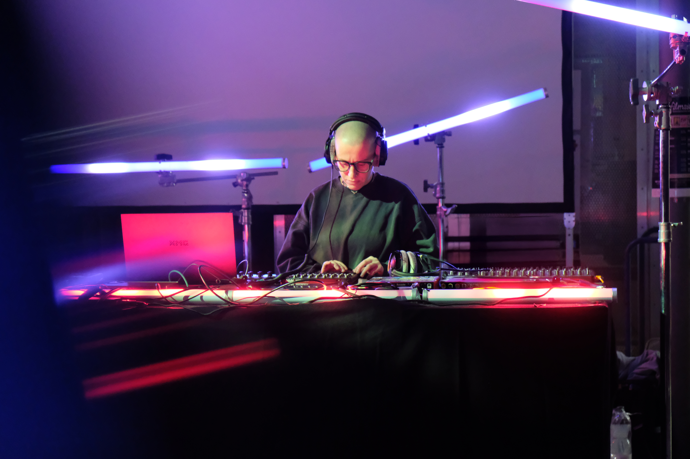
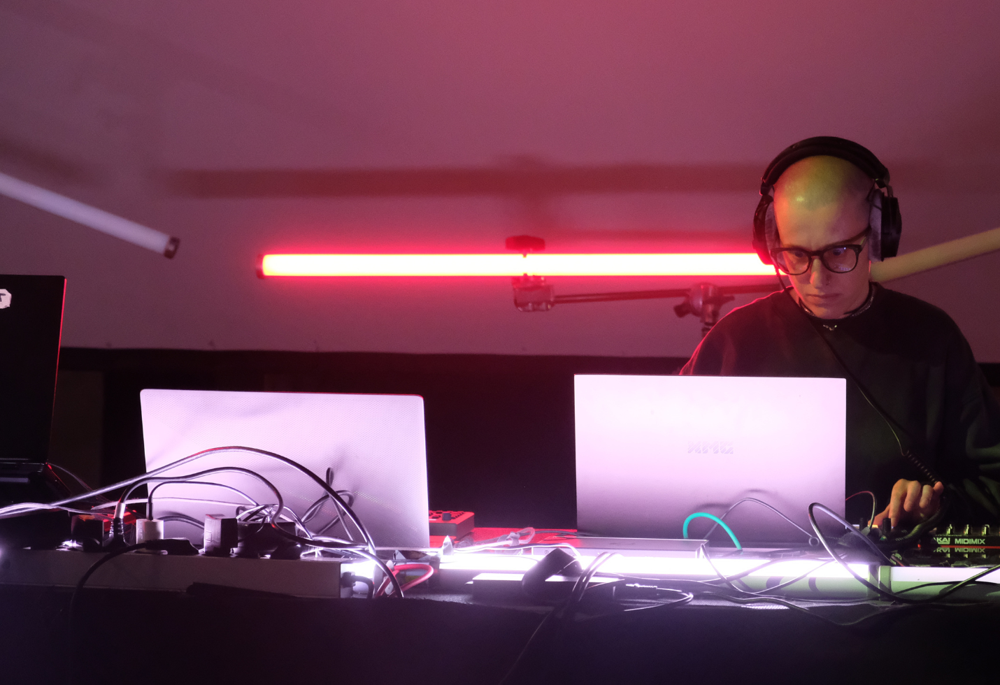
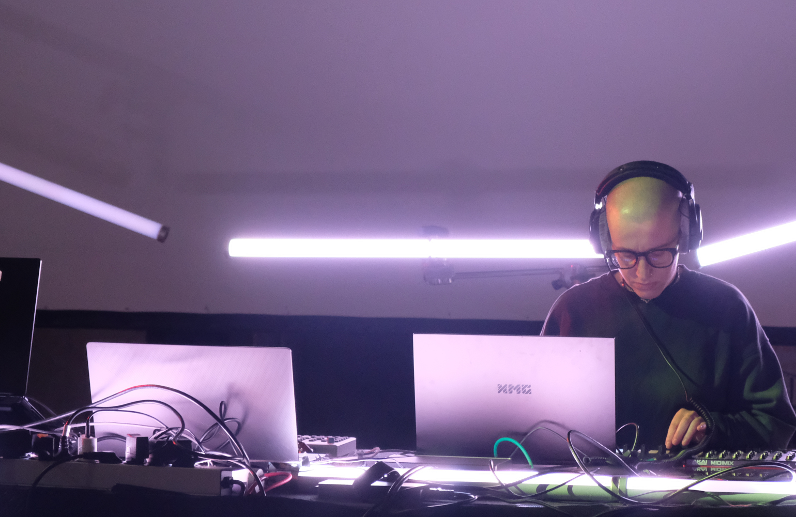
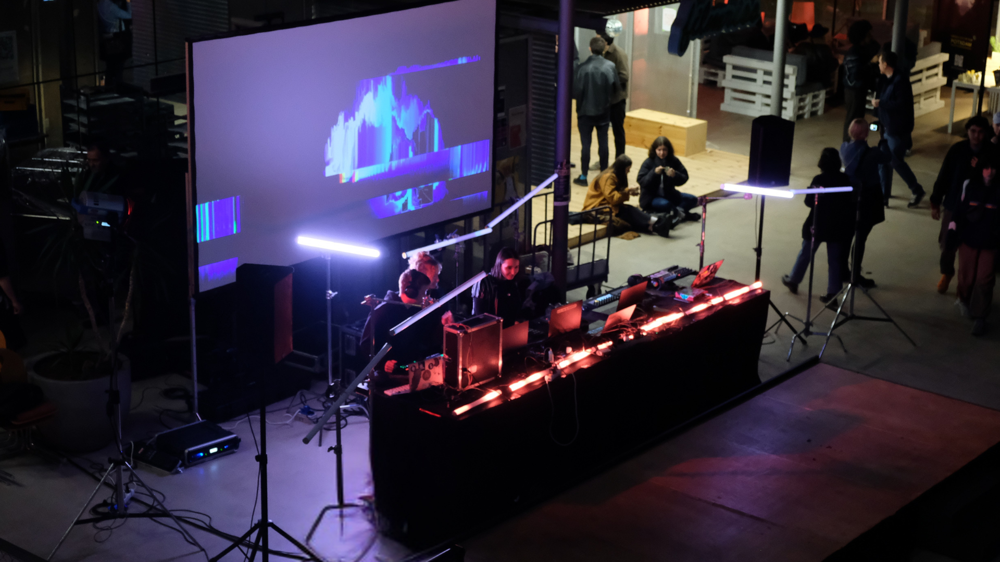
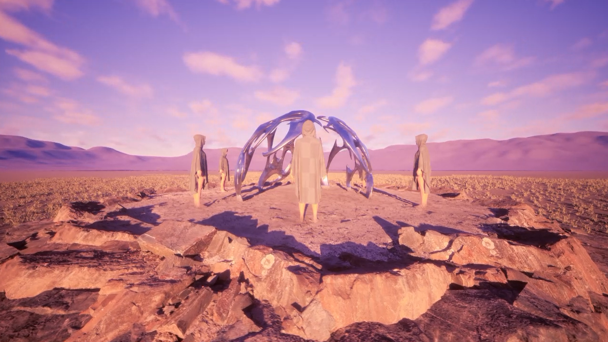
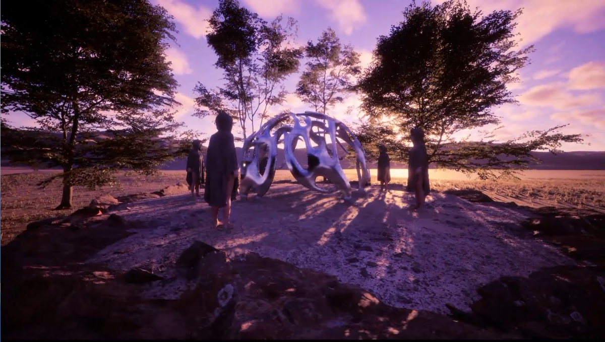

## Currents & Tides: An Exploration of Generative Music in Three Acts
 

###### Joel Schäfer, Anna Ferro, Elena Vasilkova, Andreea-Cristina Mircea, Aydin Thill, Lisa Passing, Angela Brennecke

###### Filmuniversität Babelsberg KONRAD WOLF
 
 

This documentation supports the article with audiovisual materials showcasing the performance.  
You can find all the files under this [link](https://owncloud.gwdg.de/index.php/s/noT0kvbeVzPMLRB) 
 
 

**Act I | Tidal Drift**
 <be>

 ##### **Fig. 1.** Kontrol Voltaj (Elena Vasilkova) performing at Filmuniversität Babelsberg on the occasion of the 70th anniversary celebrations, Nov 2024, in Potsdam. Image courtesy of Andreea-Cristina Mircea.  
 

 #####  **Fig. 2.** Kontrol Voltaj (Elena Vasilkova) performing at Filmuniversität Babelsberg on the occasion of the 70th anniversary celebrations, Nov 2024, in Potsdam. Image courtesy of Andreea-Cristina Mircea.  
 

 #####  **Fig. 3.** Kontrol Voltaj (Elena Vasilkova) performing at Filmuniversität Babelsberg on the occasion of the 70th anniversary celebrations, Nov 2024, in Potsdam. Image courtesy of Andreea-Cristina Mircea.  
  

🎧 **Audio Sample:** You can find the file under the name **KV_audio.wav** [here](https://owncloud.gwdg.de/index.php/s/noT0kvbeVzPMLRB)   
🎥 **Video Sample:** You can find the file under the name **KV_video.MP4** [here](https://owncloud.gwdg.de/index.php/s/noT0kvbeVzPMLRB)  
  
**Act II | Multimodal Recursions**
 <be>

  
 #####  **Fig. 4.** Perspective view of Joel Schäfer and Anna Ferro performing  with collaborator Elisabeth Scholz at Filmuniversität Babelsberg on the occasion of the 70th anniversary celebrations, Nov 2024, in Potsdam. Image courtesy of Andreea-Cristina Mircea.  
 

  
 #####  **Fig. 5.** Perspective view of Joel Schäfer and Anna Ferro performing  with collaborator Elisabeth Scholz at Filmuniversität Babelsberg on the occasion of the 70th anniversary celebrations, Nov 2024, in Potsdam. Image courtesy of Andreea-Cristina Mircea. 
<be>

  
 #####  **Fig. 6.** Joel Schäfer (left) and Anna Ferro (right) performing with collaborator Elisabeth Scholz (middle) at Filmuniversität Babelsberg on the occasion of the 70th anniversary celebrations, Nov 2024, in Potsdam. Image courtesy of Andreea-Cristina Mircea.  
 <be>

🎥 **Video Sample:** You can also find the file under the name **MR_video.mp4** [here](https://owncloud.gwdg.de/index.php/s/noT0kvbeVzPMLRB)
  

**Act III | Hybrid Rituals**
  

  
#####  **Fig. 7.** *Hybrid Ritual.* Image courtesy of Aydin Thill.  
 

  
#####  **Fig. 8.** *Hybrid Ritual.* Image courtesy of Aydin Thill.  
 

  
#####  **Fig. 9.** *Hybrid Ritual.* Image courtesy of Aydin Thill.  
  

🎧 **Audio Sample:** You can also find the file under the name **HR_audio.wav** [here](https://owncloud.gwdg.de/index.php/s/noT0kvbeVzPMLRB)  
🎥 **Video Sample:** You can also find the file under the name **HR_video.mp4** [here](https://owncloud.gwdg.de/index.php/s/noT0kvbeVzPMLRB)
